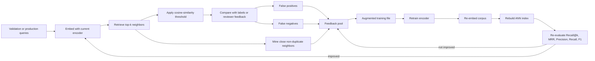

# Deduplication Embedding

Learning site: [mudit1729.github.io/deduplication_embedding](https://mudit1729.github.io/deduplication_embedding/)

Local near-duplicate question detection on the Quora Question Pairs dataset using:

- `sentence-transformers`
- `hnswlib`
- `datasets`
- `scikit-learn`
- `pandas`
- `numpy`

The repo is intentionally small enough to run on a MacBook, but it follows the same retrieval-first pattern you would use in production:

1. prepare a real labeled pair dataset
2. build a unique corpus of candidate questions
3. encode the corpus with a sentence-transformer
4. build a local ANN index with HNSW
5. retrieve top-k semantic neighbors
6. threshold cosine similarity for duplicate vs non-duplicate
7. evaluate both retrieval and pair classification
8. mine hard examples for a simple active-learning loop

## What Is In This Repo

```text
.
├── README.md
├── data/
│   ├── processed/
│   └── raw/
├── indices/
├── models/
├── notebooks/
├── requirements.txt
├── run_pipeline.sh
└── src/
    ├── active_learning.py
    ├── build_index.py
    ├── evaluate.py
    ├── prepare_data.py
    ├── search.py
    ├── train_encoder.py
    └── utils.py
```

## Dataset

- Source: [sentence-transformers/quora-duplicates](https://huggingface.co/datasets/sentence-transformers/quora-duplicates)
- Subset used here: `pair-class`
- Fields used: `sentence1`, `sentence2`, `label`

Default local subset sizes:

- train pairs: `30,000`
- validation pairs: `5,000`
- corpus size: `40,000` unique questions

## Mac Setup

Use Python `3.11` or `3.12`. The runs documented below were executed on Apple Silicon macOS with Python `3.11`.

```bash
python3.11 -m venv .venv
source .venv/bin/activate
python -m pip install --upgrade pip setuptools wheel
pip install -r requirements.txt
```

Notes:

- `accelerate` is included because current `sentence-transformers` fine-tuning uses the Hugging Face trainer stack.
- `faiss-cpu` is included as an optional vector-index backend. On Mac this is CPU-only, which is fine for this repo size.
- If `hnswlib` fails to build, run `xcode-select --install`.
- If MPS is unstable on your machine, add `--device cpu` to the training and evaluation commands.

## Quickstart

### 1. Prepare data

```bash
python src/prepare_data.py
```

Outputs:

- `data/raw/quora_pair_class_sample_raw.csv`
- `data/processed/train_pairs.csv`
- `data/processed/validation_pairs.csv`
- `data/processed/corpus.csv`
- `data/processed/data_summary.json`

### 2. Embed the baseline corpus

```bash
python src/train_encoder.py --mode embed
```

Default encoder:

- `sentence-transformers/all-MiniLM-L6-v2`

Outputs:

- `models/corpus_embeddings.npy`
- `models/embedding_metadata.json`

### 3. Build the ANN index

```bash
python src/build_index.py
```

Outputs:

- `indices/quora_hnsw.index`
- `indices/quora_hnsw_metadata.json`
- `indices/id_mapping.csv`

### Optional: build a FAISS index instead

The repo still defaults to `hnswlib`, but you can now build a FAISS index too. The current FAISS backend uses `IndexFlatIP`, which is exact inner-product search over normalized embeddings. That makes it a clean cosine-similarity backend for this project.

```bash
python src/build_index.py \
  --index_backend faiss \
  --space ip \
  --index_file indices/quora_faiss.index \
  --metadata_file indices/quora_faiss_metadata.json \
  --mapping_file indices/id_mapping_faiss.csv
```

Then use the matching index for evaluation and search:

```bash
python src/evaluate.py \
  --index_file indices/quora_faiss.index \
  --index_metadata_file indices/quora_faiss_metadata.json

python src/search.py \
  --index_file indices/quora_faiss.index \
  --index_metadata_file indices/quora_faiss_metadata.json \
  --query "How can I learn Python fast?" \
  --top_k 5
```

Mac note:

- on macOS, `torch` and `faiss-cpu` can conflict over OpenMP runtime loading; the repo now applies the minimal environment workaround automatically before those libraries import

### 4. Evaluate

```bash
python src/evaluate.py
```

Metrics:

- `Recall@1`
- `Recall@5`
- `MRR`
- `Precision`
- `Recall`
- `F1`
- cosine threshold sweep
- average precision for pair scoring

Outputs:

- `models/validation_threshold_sweep.csv`
- `models/validation_pair_scores.csv`
- `models/validation_retrieval_results.csv`
- `models/evaluation_summary.json`

### 5. Search

```bash
python src/search.py --query "How can I learn Python fast?" --top_k 5
```

### 6. Mine active-learning examples

```bash
python src/active_learning.py
```

Outputs:

- `data/processed/false_positives.csv`
- `data/processed/false_negatives.csv`
- `data/processed/hard_negatives.csv`
- `data/processed/active_learning_feedback_examples.csv`
- `data/processed/train_pairs_active_learning.csv`

## Fine-Tuning

`src/train_encoder.py` now supports four fine-tuning losses:

- `--loss_type cosine`
- `--loss_type contrastive`
- `--loss_type multiple_negatives`
- `--loss_type triplet`

Recommended usage:

- `contrastive` is the best pair-classification baseline in this repo
- `multiple_negatives` is the simplest retrieval-oriented objective because it trains on positive pairs and uses the rest of the batch as negatives
- `triplet` is the explicit hard-negative option when you have mined negatives for the same anchor distribution as your positive training data

Example:

```bash
python src/train_encoder.py \
  --mode finetune \
  --loss_type contrastive \
  --contrastive_margin 0.5 \
  --epochs 1 \
  --train_batch_size 32 \
  --output_model_dir models/quora_miniLM_contrastive \
  --embed_after_training \
  --output_embeddings models/corpus_embeddings_contrastive.npy \
  --embedding_metadata_file models/embedding_metadata_contrastive.json
```

Then build and evaluate the matching index:

```bash
python src/build_index.py \
  --embeddings_file models/corpus_embeddings_contrastive.npy \
  --embedding_metadata_file models/embedding_metadata_contrastive.json \
  --index_file indices/quora_hnsw_contrastive.index \
  --metadata_file indices/quora_hnsw_contrastive_metadata.json \
  --mapping_file indices/id_mapping_contrastive.csv

python src/evaluate.py \
  --model_name_or_path models/quora_miniLM_contrastive \
  --embeddings_file models/corpus_embeddings_contrastive.npy \
  --index_file indices/quora_hnsw_contrastive.index \
  --index_metadata_file indices/quora_hnsw_contrastive_metadata.json \
  --threshold_csv models/validation_threshold_sweep_contrastive.csv \
  --pair_scores_csv models/validation_pair_scores_contrastive.csv \
  --retrieval_csv models/validation_retrieval_results_contrastive.csv \
  --summary_json models/evaluation_summary_contrastive.json
```

## Retrieval-Oriented Fine-Tuning

If your next goal is better nearest-neighbor retrieval rather than only better pair classification, there are now two explicit retrieval-style options.

### Option 1. MultipleNegativesRankingLoss

This uses only positive duplicate pairs. Every other item in the batch acts as an implicit negative, which makes it a good first retrieval objective on a laptop.

```bash
python src/train_encoder.py \
  --mode finetune \
  --loss_type multiple_negatives \
  --epochs 1 \
  --train_batch_size 32 \
  --output_model_dir models/quora_miniLM_mnrl \
  --embed_after_training \
  --output_embeddings models/corpus_embeddings_mnrl.npy \
  --embedding_metadata_file models/embedding_metadata_mnrl.json
```

Notes:

- this path automatically filters the training file down to positive pairs
- larger batch sizes usually help more here than with cosine loss
- if memory is tight on Mac, drop `--train_batch_size` to `16`

### Option 2. Triplet Loss With Hard Negatives

This uses `(anchor, positive, negative)` triplets and can consume a mined negative file via `--hard_negative_file`.

```bash
python src/train_encoder.py \
  --mode finetune \
  --loss_type triplet \
  --train_file data/processed/train_pairs_active_learning_contrastive.csv \
  --hard_negative_file data/processed/hard_negatives_contrastive.csv \
  --triplet_distance_metric cosine \
  --triplet_margin 0.2 \
  --triplets_per_positive 1 \
  --epochs 1 \
  --train_batch_size 32 \
  --output_model_dir models/quora_miniLM_triplet \
  --embed_after_training \
  --output_embeddings models/corpus_embeddings_triplet.npy \
  --embedding_metadata_file models/embedding_metadata_triplet.json
```

Important caveat:

- triplet training is strongest when the hard-negative file was mined for the same anchor set used in the positive training pairs
- if the anchors barely overlap, the script still falls back to negative pairs from the training file itself, but the resulting triplet set will be smaller and less useful
- the training summary written to `training_summary.json` includes `triplet_examples_used`, `anchors_with_triplets`, and `mined_negative_triplets` so you can see whether the negative source was actually helping

### Mining Hard Negatives For The Training Anchor Set

`src/active_learning.py` can now mine hard negatives from a separate anchor file instead of only from validation `question1` anchors. This is the recommended way to prepare triplet training data that actually overlaps with the positives used for retraining.

Example:

```bash
python src/active_learning.py \
  --train_file data/processed/train_pairs.csv \
  --validation_file data/processed/validation_pairs.csv \
  --model_name_or_path models/quora_miniLM_contrastive \
  --embeddings_file models/corpus_embeddings_contrastive.npy \
  --index_file indices/quora_hnsw_contrastive.index \
  --index_metadata_file indices/quora_hnsw_contrastive_metadata.json \
  --threshold_summary_file models/evaluation_summary_contrastive.json \
  --hard_negative_anchor_file data/processed/train_pairs.csv \
  --hard_negative_positive_only \
  --hard_negative_use_both_question_columns \
  --hard_negatives_output data/processed/hard_negatives_contrastive_train_anchors.csv \
  --feedback_output data/processed/active_learning_feedback_examples_contrastive_train_anchors.csv \
  --updated_train_output data/processed/train_pairs_active_learning_contrastive_train_anchors.csv
```

In the documented run:

- hard-negative anchor queries: `19,033`
- aligned hard negatives found: `261`
- triplet examples built later: `649`
- triplets using mined negatives: `294`

## Comparing Retrieval Mechanisms

The repo now includes a retrieval benchmark script:

```bash
python src/compare_retrievers.py \
  --summary_csv models/retriever_comparison.csv \
  --details_csv models/retriever_comparison_details.csv
```

It compares:

- dense HNSW retrieval
- dense exact retrieval
- dense FAISS retrieval
- word-level TF-IDF retrieval
- character n-gram TF-IDF retrieval
- a simple dense + character-TF-IDF hybrid

Measured retrieval results on the default setup:

| Method | Recall@1 | Recall@5 | MRR |
| --- | ---: | ---: | ---: |
| Hybrid dense + char TF-IDF | 0.6213 | 0.8353 | 0.7056 |
| Dense HNSW | 0.6046 | 0.8267 | 0.6911 |
| Dense exact | 0.6046 | 0.8267 | 0.6911 |
| Dense FAISS | 0.6046 | 0.8267 | 0.6911 |
| TF-IDF char n-gram | 0.5553 | 0.7736 | 0.6382 |
| TF-IDF word n-gram | 0.4540 | 0.6679 | 0.5345 |

Interpretation:

- exact dense search, FAISS exact search, and HNSW are effectively identical at this corpus size
- lexical retrieval alone is weaker than dense retrieval, but character n-grams are noticeably better than word TF-IDF for near-duplicate questions
- the best retriever in this comparison is the simple dense + character-TF-IDF hybrid
- the hybrid wins because dense retrieval captures semantic paraphrases while character n-grams recover lexical overlap, spelling variants, and short phrase reuse that cosine similarity alone sometimes underweights
- this is the main production lesson from the comparison: better retrieval does not always require a new encoder, sometimes it requires fusing a semantic signal with a cheap lexical signal

That makes the hybrid retriever the next logical candidate to wire into the main search pipeline if you want better candidate generation without changing the encoder.

## Active-Learning Loop

The best run in this repo came from improving the data loop, not from adding the most complicated loss.



Why this matters:

- false positives teach the model where the duplicate boundary is too loose
- false negatives teach the model where duplicate paraphrases are still too far apart
- hard negatives teach retrieval which close neighbors should not collapse together
- re-indexing is part of the learning loop because new embeddings without a new index do not change retrieval behavior

## Contrastive Loss Math

The documented fine-tuning run uses `sentence_transformers.losses.ContrastiveLoss` with:

- distance metric: `SiameseDistanceMetric.COSINE_DISTANCE`
- margin: `0.5`

For a question pair `(q1, q2)`, let the encoder produce embeddings:

```text
e1 = f(q1)
e2 = f(q2)
```

Cosine similarity is:

```text
s(q1, q2) = (e1 dot e2) / (||e1|| ||e2||)
```

The loss uses cosine distance:

```text
d(q1, q2) = 1 - s(q1, q2)
```

With label `y in {0, 1}` where `1` means duplicate and `0` means non-duplicate, the actual library loss is:

```text
L = 0.5 * [ y * d^2 + (1 - y) * max(0, m - d)^2 ]
```

where `m` is the contrastive margin.

This splits into two cases:

### Positive pair term

If `y = 1`:

```text
L_pos = 0.5 * d^2
```

So duplicate questions are optimized by shrinking cosine distance toward `0`, which means pushing cosine similarity toward `1`.

### Negative pair term

If `y = 0`:

```text
L_neg = 0.5 * max(0, m - d)^2
```

So non-duplicate questions are only penalized when they are too close. If the distance is already at least the margin, they contribute zero loss.

That hinge behavior matters:

- easy negatives stop consuming gradient once they are far enough apart
- hard negatives keep contributing gradient because they still sit inside the margin
- training therefore spends more effort on the confusing non-duplicates that actually hurt retrieval and thresholding

### What the margin means geometrically

Because the training distance is `d = 1 - s`, a margin of `m = 0.5` means a negative pair stops being penalized once:

```text
1 - s >= 0.5
```

or equivalently:

```text
s <= 0.5
```

This is a training boundary, not the serving threshold.

That distinction is important because the best duplicate decision threshold from evaluation was around `0.77`, not `0.50`. These two numbers solve different problems:

- the contrastive margin controls representation geometry during training
- the serving threshold controls the precision-recall tradeoff for the final duplicate decision

In other words, training says "push non-duplicates at least this far apart," while evaluation says "given the resulting embedding space, what similarity cutoff gives the best F1 on held-out data?"

### Why contrastive loss worked well here

Compared with plain cosine regression, contrastive loss is better aligned with de-duplication:

- positives are explicitly pulled together
- negatives are explicitly pushed apart
- the margin prevents wasting capacity on already-separated negatives
- mined hard negatives naturally become high-value training examples because they sit inside the active part of the hinge

That is why `contrastive + active learning` outperformed the baseline in this repo: the model was retrained on examples that fell near the real operational boundary.

## Contrastive Loss -> Active Learning -> Retrain

This is the workflow that produced the best model in this repo.

### Step 1. Train a contrastive encoder

```bash
python src/train_encoder.py \
  --mode finetune \
  --loss_type contrastive \
  --contrastive_margin 0.5 \
  --epochs 1 \
  --train_batch_size 32 \
  --output_model_dir models/quora_miniLM_contrastive \
  --embed_after_training \
  --output_embeddings models/corpus_embeddings_contrastive.npy \
  --embedding_metadata_file models/embedding_metadata_contrastive.json
```

### Step 2. Build and evaluate the contrastive index

```bash
python src/build_index.py \
  --embeddings_file models/corpus_embeddings_contrastive.npy \
  --embedding_metadata_file models/embedding_metadata_contrastive.json \
  --index_file indices/quora_hnsw_contrastive.index \
  --metadata_file indices/quora_hnsw_contrastive_metadata.json \
  --mapping_file indices/id_mapping_contrastive.csv

python src/evaluate.py \
  --model_name_or_path models/quora_miniLM_contrastive \
  --embeddings_file models/corpus_embeddings_contrastive.npy \
  --index_file indices/quora_hnsw_contrastive.index \
  --index_metadata_file indices/quora_hnsw_contrastive_metadata.json \
  --threshold_csv models/validation_threshold_sweep_contrastive.csv \
  --pair_scores_csv models/validation_pair_scores_contrastive.csv \
  --retrieval_csv models/validation_retrieval_results_contrastive.csv \
  --summary_json models/evaluation_summary_contrastive.json
```

### Step 3. Mine active-learning examples from the contrastive model

```bash
python src/active_learning.py \
  --model_name_or_path models/quora_miniLM_contrastive \
  --embeddings_file models/corpus_embeddings_contrastive.npy \
  --index_file indices/quora_hnsw_contrastive.index \
  --index_metadata_file indices/quora_hnsw_contrastive_metadata.json \
  --threshold_summary_file models/evaluation_summary_contrastive.json \
  --false_positives_output data/processed/false_positives_contrastive.csv \
  --false_negatives_output data/processed/false_negatives_contrastive.csv \
  --hard_negatives_output data/processed/hard_negatives_contrastive.csv \
  --feedback_output data/processed/active_learning_feedback_examples_contrastive.csv \
  --updated_train_output data/processed/train_pairs_active_learning_contrastive.csv
```

What this produced in the documented run:

- feedback examples: `2,066`
- false positives: `527`
- false negatives: `244`
- hard negatives: `1,295`
- updated training rows: `31,539`

### Step 4. Retrain on the augmented file

```bash
python src/train_encoder.py \
  --mode finetune \
  --loss_type contrastive \
  --contrastive_margin 0.5 \
  --train_file data/processed/train_pairs_active_learning_contrastive.csv \
  --max_train_examples 0 \
  --epochs 1 \
  --train_batch_size 32 \
  --output_model_dir models/quora_miniLM_contrastive_active \
  --embed_after_training \
  --output_embeddings models/corpus_embeddings_contrastive_active.npy \
  --embedding_metadata_file models/embedding_metadata_contrastive_active.json
```

### Step 5. Build and evaluate the post-active-learning model

```bash
python src/build_index.py \
  --embeddings_file models/corpus_embeddings_contrastive_active.npy \
  --embedding_metadata_file models/embedding_metadata_contrastive_active.json \
  --index_file indices/quora_hnsw_contrastive_active.index \
  --metadata_file indices/quora_hnsw_contrastive_active_metadata.json \
  --mapping_file indices/id_mapping_contrastive_active.csv

python src/evaluate.py \
  --model_name_or_path models/quora_miniLM_contrastive_active \
  --embeddings_file models/corpus_embeddings_contrastive_active.npy \
  --index_file indices/quora_hnsw_contrastive_active.index \
  --index_metadata_file indices/quora_hnsw_contrastive_active_metadata.json \
  --threshold_csv models/validation_threshold_sweep_contrastive_active.csv \
  --pair_scores_csv models/validation_pair_scores_contrastive_active.csv \
  --retrieval_csv models/validation_retrieval_results_contrastive_active.csv \
  --summary_json models/evaluation_summary_contrastive_active.json
```

## Measured Results

The following metrics were produced from actual local runs in this repo on the default 30k / 5k / 40k setup.

| Model | Avg Precision | Precision | Recall | F1 | Best Threshold | Recall@1 | Recall@5 | MRR |
| --- | ---: | ---: | ---: | ---: | ---: | ---: | ---: | ---: |
| Baseline MiniLM | 0.7628 | 0.6505 | 0.8451 | 0.7352 | 0.7600 | 0.6046 | 0.8267 | 0.6912 |
| Contrastive Fine-Tune | 0.8465 | 0.7525 | 0.8678 | 0.8060 | 0.7800 | 0.5997 | 0.8131 | 0.6824 |
| Contrastive + Active Learning | 0.8647 | 0.7714 | 0.9122 | 0.8359 | 0.7700 | 0.6051 | 0.8250 | 0.6892 |
| Contrastive Warm-Start + Aligned Triplet | 0.8430 | 0.7351 | 0.8900 | 0.8052 | 0.7400 | 0.5975 | 0.8131 | 0.6805 |

Interpretation:

- contrastive loss gives a large win on pair classification quality
- a naive cosine-loss fine-tune helped classification too, but hurt retrieval more sharply, so it is not the focus here
- contrastive plus one active-learning retrain kept retrieval almost flat versus baseline while materially improving precision, recall, F1, and average precision
- aligned triplet training successfully increased the share of truly mined negatives inside the triplet dataset, but this first run did not beat the contrastive or contrastive-plus-active baselines on retrieval or classification

That final tradeoff is the best fit for this toy retrieval-first pipeline.

## Example Query

Using the final `contrastive + active learning` model:

```bash
python src/search.py \
  --model_name_or_path models/quora_miniLM_contrastive_active \
  --embeddings_file models/corpus_embeddings_contrastive_active.npy \
  --index_file indices/quora_hnsw_contrastive_active.index \
  --index_metadata_file indices/quora_hnsw_contrastive_active_metadata.json \
  --threshold_summary_file models/evaluation_summary_contrastive_active.json \
  --query "How can I learn Python fast?" \
  --top_k 5
```

Top result in the documented run:

- `What's the best way to learn Python?` with score `0.8759`

## One-Command Baseline Run

```bash
bash run_pipeline.sh
```

This script runs:

1. data preparation
2. baseline embedding
3. baseline HNSW build
4. baseline evaluation
5. a sample search

## Why This Mirrors Production

This repo is still a toy, but the system shape is realistic:

- dense embeddings for semantic candidate generation
- ANN retrieval for low-latency nearest-neighbor lookup
- a thresholding decision layer on top of retrieval
- offline evaluation for both retrieval and classification
- active-learning exports to drive the next training cycle

In a larger production system, you would usually:

- keep the corpus in a database or service instead of CSV
- refresh embeddings on a schedule
- use human or user feedback as labels
- route difficult cases into a stronger reranker or classifier

## Common Mac Issues

### Python version

- Avoid system Python `3.14` for this project
- Prefer `python3.11` or `python3.12`

### `hnswlib` build errors

```bash
xcode-select --install
python -m pip install --upgrade pip setuptools wheel
```

### MPS instability

Force CPU if needed:

```bash
python src/train_encoder.py --mode embed --device cpu
python src/evaluate.py --device cpu
python src/search.py --device cpu --query "How can I learn Python fast?"
```

### Slow first run

The first run downloads:

- the Quora dataset
- the MiniLM encoder
- tokenizer/model caches

After that, reruns are much faster.
